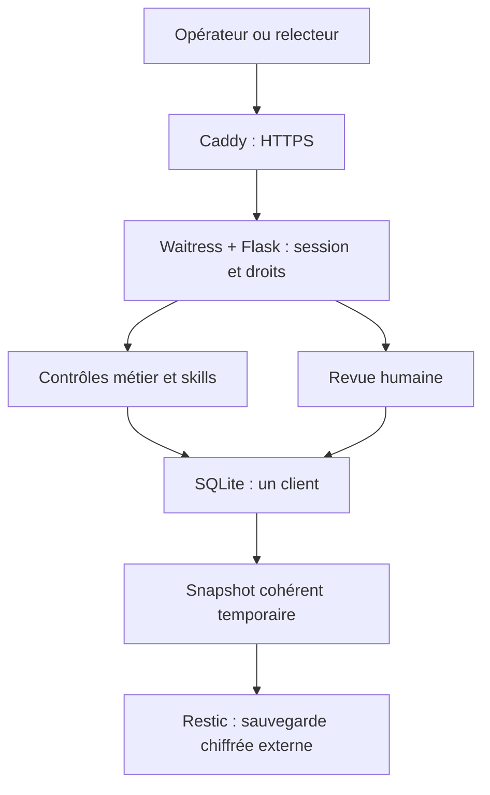

# Architecture livrée et limites de lancement

Mise à jour le 2 octobre 2026. Deux modes utilisent le même moteur métier et les mêmes skills. Le serveur local reste une démonstration sans authentification, lié à la boucle locale. Le service de production utilise un serveur distinct avec authentification, MFA et limites de capacité.

## Une instance dédiée par client

Le chemin de sauvegarde est livré sous forme d'outils et de scripts ; sa destination distante doit être configurée puis vérifiée sur l'hôte du client. Aucun hébergement distant n'est configuré automatiquement par la publication GitHub.

Une VM/IP, un projet Compose, un domaine, un répertoire de données, une identité client et des secrets distincts pour chaque entreprise. La base est liée à son identifiant : un montage attribué à une autre entreprise est refusé. Cela n'est pas un mécanisme de multi-tenancy dans une base partagée. Un administrateur de l'hôte garde techniquement accès aux données de son serveur ; l'hébergement, les habilitations et le chiffrement des volumes restent à configurer.

L'application tourne sans privilèges root, avec un système de fichiers en lecture seule hors des données et du temporaire. Le réseau Compose privé interdit les connexions externes du conteneur applicatif ; seul Caddy possède une interface exposée et un accès réseau externe. L'application n'a aucun port publié. Ne jamais exposer directement Waitress ou remplacer ce service par `python -m admin_agent`.

## Authentification, permissions et sessions

- Comptes individuels administrés par CLI sur l'hôte ; aucun compte par défaut, inscription publique ou récupération par email.
- Mot de passe haché scrypt et code TOTP obligatoire. Les secrets TOTP sont chiffrés avec Fernet ; la clé est dérivée du secret d'instance avec séparation d'usage. Le rejeu d'un pas TOTP est refusé dans une transaction atomique.
- Jetons de session opaques aléatoires, stockés sous forme HMAC dans SQLite. Durée absolue 8 heures, inactivité 30 minutes, pré-session anonyme 15 minutes.
- Cookie `__Host-admin_agent_session` Secure, HttpOnly, SameSite=Strict. Origin exact et jeton CSRF exigés pour les mutations, y compris connexion et déconnexion. Aucun jeton n'est placé dans localStorage.
- Rôle `reader` en lecture seule ; `operator` pour créer, corriger, analyser et relire ; `admin` avec export supplémentaire. Ces droits sont vérifiés par le serveur. Les rôles ne contraignent pas la revue à une personne différente du préparateur : cette séparation doit être organisée par la procédure de service si elle est requise.
- Changement de rôle, désactivation, renouvellement du mot de passe ou du MFA : sessions révoquées. Le renouvellement du secret d'instance invalide les sessions et exige le renouvellement des enrôlements MFA ; suivre la procédure de reprise, pas une modification improvisée de fichier.
- L'interface purge les données à la déconnexion, à l'expiration et après refus d'authentification ; elle ne rejoue pas les demandes après reconnexion. Une notification entre onglets ne transporte aucune donnée de dossier ni aucun secret.

Les entêtes de proxy ne servent pas à accorder des droits ni à identifier un utilisateur. Waitress conserve une origine HTTPS fixe derrière le terminateur TLS ; Host et Origin publics sont vérifiés. Le compartiment réseau doit donc être conservé. Le quota par adresse distante voit Caddy comme un pair unique : il protège l'ensemble de l'instance, en complément du quota individuel, pas chaque IP Internet séparément.

## Données et capacités de la première release

SQLite WAL gère les dossiers, les événements métier, l'identité client, les comptes, les sessions et l'audit d'authentification. Les écritures sensibles sont transactionnelles. L'acteur nominatif de la requête remplace l'acteur local dans la trace métier. Les entrées restent déclaratives : elles ne prouvent pas qu'une facture existe ou qu'un paiement a eu lieu.

La capacité de lancement est limitée à **100 dossiers cumulés et 20 000 événements métier** par instance. Un résultat d'analyse dépassant 32 Kio est refusé avec une instruction de découpage du dossier. Les listes de production contiennent des résumés ; le dossier complet est chargé à son ouverture. La recherche de ces listes porte sur leurs champs visibles, pas sur toutes les valeurs du payload.

Les événements d'authentification sont bornés à 50 000 entrées et 90 jours. Ce sont des choix techniques de cette version, à intégrer à la politique contractuelle ; ce ne sont pas des durées légales universelles. Les dossiers et leurs événements ne sont pas purgés automatiquement. Les sauvegardes suivent une politique séparée à définir. Ne pas dépasser les plafonds par une modification non testée ou en supprimant directement des lignes SQL.

L'export JSON est un outil de restitution métier pour l'administrateur, pas une sauvegarde complète des accès. La sauvegarde utilise l'API SQLite pour produire un snapshot cohérent avec manifeste et checksum. La restauration refuse d'écraser une cible existante et contrôle l'identité du client. Elle désactive les comptes restaurés et invalide leurs moyens d'accès afin de ne pas réactiver des droits anciens. La remise en service exige de revalider la liste des personnes puis leurs nouveaux mots de passe et MFA.

## Frontière de l'IA

**L'IA externe est désactivée dans le serveur de production de cette release.** L'activer par variable d'environnement est refusé. Les quatre workflows disponibles reposent sur les contrôles déterministes. Les huit autres skills sont guidées et ne deviennent pas des automatismes par leur seule présence dans le catalogue.

L'adaptateur local `admin_agent/llm.py` appelle uniquement l'API Responses officielle, sans tools, avec schéma JSON strict et `store:false`. Il transmet le dossier courant, une skill, le pack pays et le résultat local. Le contexte est borné à 24 000 octets et la sortie à 1 200 tokens ; ce n'est pas un plafond monétaire. L'avis est séparé sous `ai_advice` et ne remplace pas les calculs ou les règles d'approbation. Les références aux champs sont vérifiées, pas la vérité de chaque conclusion.

Sources techniques de l'adaptateur : [Structured Outputs](https://developers.openai.com/api/docs/guides/structured-outputs) et [Responses API](https://developers.openai.com/api/docs/guides/migrate-to-responses). `store:false` ne garantit pas à lui seul une conservation nulle chez un fournisseur. Aucun appel réel de qualification métier n'a été exécuté ; l'activation future nécessite évaluation, gouvernance des données, quotas persistants et nouvelle recette.

## Références techniques de production

Consultées le 02/10/2026 : [sécurité Flask](https://flask.palletsprojects.com/en/stable/web-security/), [serveur Waitress](https://docs.pylonsproject.org/projects/waitress/en/stable/), [HTTPS Caddy](https://caddyserver.com/docs/quick-starts/https), [PyOTP et prévention du rejeu](https://pyauth.github.io/pyotp/), [Fernet](https://cryptography.io/en/latest/fernet/). Les versions livrées sont épinglées dans les requirements, le Dockerfile et Compose ; enregistrer aussi le digest réellement déployé.

Consulter le [guide client](launch/00-START-HERE.md), le [rapport QA](QA.md) et le [backlog](ROADMAP.md) pour les preuves et les éléments encore à réaliser.
