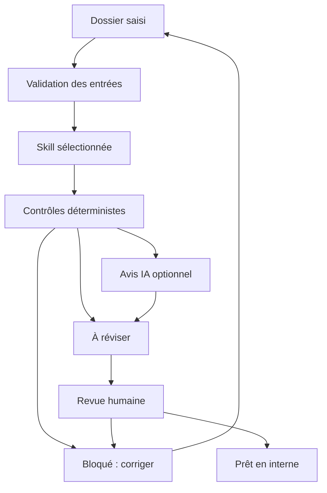

# Architecture livrée et trajectoire

## Application locale
Python standard library, serveur HTTP lié à l'interface de boucle locale, SQLite pour dossiers et événements, frontend HTML/CSS/JavaScript sans dépendance distante. Une seule entreprise et un seul opérateur de confiance dans cette version. La base locale n'est pas chiffrée par l'application ; l'export contient les données des dossiers et doit rester sous contrôle de l'opérateur.

Le schéma présente les relations fonctionnelles, pas des agents indépendants s'appelant sans limite. Le routage est explicite par compétence ; la qualification aide au tri. Le stockage gère les transitions et l'audit. Les interfaces ne disposent d'aucun outil d'envoi ou de paiement.

## Context engineering effectivement implémenté
Le mode IA charge le dossier courant, les instructions d'une compétence, le pack du pays et le résultat des contrôles locaux. Aucun historique d'autres dossiers ou corpus complet n'est chargé. Un plafond de 24 000 octets sur instructions et contexte est imposé ; au-delà, l'appel est refusé plutôt que de couper silencieusement une preuve. La sortie est plafonnée à 1 200 tokens.

L'estimation d'entrée utilise les octets UTF-8 divisés par quatre : ce n'est pas un comptage exact de tokens ni une garantie monétaire. Le nombre réel de tokens renvoyé par le fournisseur et la latence sont conservés lorsqu'ils sont disponibles. Le hash du contexte permet d'identifier l'entrée utilisée. Le cache d'extraction, une base vectorielle et les quotas monétaires persistants restent à développer.

## Frontière du modèle
`admin_agent/llm.py` appelle uniquement l'API Responses officielle, sans tools, avec un schéma JSON strict et `store:false`. Une activation serveur, une clé et un modèle explicites sont nécessaires, puis l'utilisateur choisit l'analyse IA sur le dossier. `store:false` ne constitue pas une promesse de conservation nulle : les modalités du fournisseur et le traitement des données doivent être qualifiés avant usage réel.

L'avis IA est séparé sous `ai_advice`. Les références de champs sont vérifiées ; cela établit leur existence, pas la vérité du raisonnement généré. Le modèle ne peut remplacer ni les contrôles de montants ni le statut d'approbation. Les sorties incomplètes, refusées, mal formées ou proposant un appel d'outil sont rejetées. Les erreurs fournisseur ne doivent exposer ni secret ni contenu de requête.

Sources techniques consultées le 02/10/2026 : [Structured Outputs](https://developers.openai.com/api/docs/guides/structured-outputs) et [Responses API](https://developers.openai.com/api/docs/guides/migrate-to-responses). La conformité au format ne prouve pas l'exactitude métier. Les tests locaux simulent les réponses fournisseur ; l'accès à un modèle réel dépend du compte et n'a pas été validé.

## Avant un service partagé
Ajouter authentification, RBAC, isolation des données, stockage documentaire, sauvegardes, supervision, rotation des secrets, politique de conservation et contrats de traitement. Les contrôles localhost/origine ne remplacent pas une authentification. Ne pas rendre ce serveur public ni changer sa liaison réseau pour en faire un SaaS.

## Documentation
- [Besoins et 38 fonctions](research/01-needs.md)
- [Concurrence, connecteurs et hypothèses d'offre](research/02-market.md)
- [Cadre FR/ES et critères réglementaires proposés](research/03-compliance.md)
- [Architecture des skills](skills-architecture.md)
- [Backlog](ROADMAP.md)
- [Exécution des tests et limites](QA.md)
