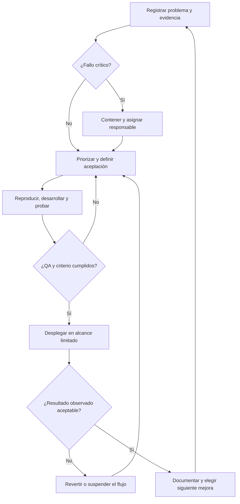

# Proceso de mejora continua

Versión documental: 6 de octubre de 2026. Aplicable a la base 0.5.0 revisada en `cf52ccdf7a2297be14ad1ad8b88e5b07d2950e7d`. Complementa la [implantación](GUIA-IMPLEMENTACION.md) y utiliza las [plantillas operativas](PLANTILLAS-OPERATIVAS.md).

**Objetivo:** reducir errores y trabajo de revisión sin perder trazabilidad ni control humano. Cada ciclo termina con una decisión documentada: aceptar, corregir de nuevo o revertir. Los criterios siguientes son una propuesta de operación; no representan una vigilancia automática ya activada.

## 1. Responsables y ritmo de trabajo

| Responsable | Compromiso |
|---|---|
| Responsable del servicio | Mantener un único backlog, escoger prioridades y aceptar el resultado de negocio |
| Operador | Registrar el problema observado, referencia privada de evidencia y tiempo real |
| Revisor de negocio / QA | Preparar el resultado esperado, comprobar casos de reserva y validar el efecto |
| Desarrollador | Reproducir, corregir y añadir regresión cuando cambia la corrección o seguridad |
| Responsable técnico | Validar entornos, backups, despliegue, supervisión y recuperación |

Separar autor y revisor en cambios de importes, estados financieros, permisos, fuentes o recuperación. Es una regla del proceso: los roles de aplicación no imponen cuatro ojos. Si el equipo no dispone de un revisor competente, el cambio crítico queda pendiente de aceptación.

| Frecuencia propuesta | Duración orientativa | Actividad y salida |
|---|---|---|
| Cada jornada de servicio | 10–15 min | Acceso, copia independiente, disco, capacidad y bloqueos; responsable de cada incidencia |
| Después de cada lote | Según volumen | Revisión de todas las piezas del piloto y registro de errores/correcciones |
| Semanal | 45 min | Leer métricas, clasificar causas y elegir como máximo dos mejoras activas |
| Por cada cambio | Según riesgo | Prueba, revisión independiente, aceptación y decisión de publicación |
| Mensual y tras un cambio importante | Según recuperación medida | Ensayo de restauración; revisión de accesos, capacidad, costes y alcance |
| Día 30 de cada piloto | 60 min | Continuar, ampliar, reducir alcance o cerrar |

La cadencia debe asignarse a personas y fechas. Los backups requieren instalar su timer; este documento no programa tareas, importaciones ni comunicaciones. Las pruebas CI sí se ejecutan en los eventos definidos por el workflow existente.

## 2. Un ciclo completo, repetible



1. **Observar.** Registrar versión, proceso, resultado esperado/real y alcance. Mantener originales y datos personales en el expediente privado; usar una reproducción ficticia para el repositorio.
2. **Clasificar.** Decidir si el fallo afecta acceso, integridad, recuperación, operación o comodidad. Contener primero un fallo crítico; no esperar a la reunión semanal.
3. **Definir el cambio.** Escribir un criterio comprobable, el responsable, los casos afectados y una condición de reversión. Medir la situación anterior con el mismo protocolo.
4. **Reproducir.** Asegurar que la prueba distingue el fallo real. Incorporar una regresión si el cambio afecta corrección material o seguridad; una corrección de texto simple necesita revisión proporcionada.
5. **Desarrollar.** Hacer un cambio limitado. No alterar reglas, cuotas o permisos para ocultar el síntoma.
6. **Probar y revisar.** Ejecutar el conjunto necesario, examinar diferencias y someter casos de reserva a otra persona. Registrar fallos y pruebas omitidas.
7. **Liberar.** Publicar una versión identificable y cualificarla en preproducción. Para desplegar, disponer de backup verificado, imagen anterior y plan de recuperación.
8. **Observar y decidir.** Revisar todas las piezas del primer lote afectado; usar cinco días laborables o los siguientes diez casos como primera ventana orientativa. Si falta volumen, registrar insuficiencia de evidencia y ampliar observación.
9. **Cerrar.** Anotar resultado, métricas comparables, limitaciones y seguimiento. Repetir con la prioridad siguiente.

Un cambio desplegado no se cierra sólo porque la CI esté verde. Una mejora que no consigue el efecto esperado puede retirarse aunque no produzca una excepción técnica.

## 3. Priorizar con severidad y evidencia

| Clase | Ejemplo | Regla de tratamiento |
|---|---|---|
| Crítica | Acceso cruzado, pérdida de datos, error de importe/identidad/estado no detectado en revisión, doble imputación o recuperación imposible | Suspender el flujo afectado y resolver antes de nuevas funciones o expansión |
| Alta | Errores OCR detectados que bloquean un lote, fuente financiera bloqueada sin procedimiento, backup que incumple el objetivo | Responsable inmediato; resolver o limitar el alcance antes del siguiente lote afectado |
| Media | Muchas correcciones, formato repetitivo no cubierto, tareas manuales evitables | Ordenar por frecuencia, tiempo y esfuerzo |
| Baja | Texto, navegación o comodidad sin impacto material | Agrupar después de resolver riesgos mayores |

Para mejoras no críticas, usar una puntuación simple:

`prioridad = impacto × frecuencia × confianza / esfuerzo`

Impacto 1–5, frecuencia 1–5, confianza 0,5 (hipótesis) o 1 (observado), esfuerzo 1/2/3/5/8 unidades relativas. No comparar estos puntos con euros ni tratarlos como medida exacta. Los fallos críticos y las condiciones obligatorias de lanzamiento prevalecen sobre la fórmula.

Limitar el trabajo activo a dos mejoras. Cada tarjeta debe tener un responsable, siguiente acción, criterio de aceptación y prueba asociada; «mejorar OCR» sin un patrón de error observado no es una tarjeta ejecutable.

## 4. Métricas que se pueden defender

Separar siempre cliente, proceso, periodo, versión, idioma/formato y cohorte sintética o real. Mostrar numerador, denominador y casos no medidos junto al resultado. Si el denominador es cero, mostrar «no disponible», nunca 0% de errores o 100% de éxito.

| Indicador | Definición | Fuente y decisión |
|---|---|---|
| Exactitud de extracción | Campos correctos / (correctos + incorrectos + ausentes) entre valores evaluables | Observaciones del piloto; medir antes de corregir; revisar por tipo de campo |
| Abstención correcta | Número de campos que debían quedar sin propuesta según evidencia independiente | Separado de exactitud; una omisión de un valor legible es un error |
| Cobertura de evaluación | (Valores evaluados + abstenciones correctas) / campos críticos previstos en casos elegibles | Registro del piloto; evita mejorar métricas excluyendo los casos difíciles |
| Errores críticos tras revisión | Expedientes con al menos un error crítico / expedientes revisados y comprobados | QA manual; cualquier caso activa investigación y suspensión del flujo afectado |
| Carga de corrección | Documentos con corrección / documentos revisados; minutos de corrección aparte | Observación inicial y final; buscar la causa dominante |
| Tiempo asistido | Tiempo activo total del proceso, con revisión y correcciones incluidas | Registrar por caso; mediana y número de casos; espera separada |
| Ganancia observada | (Suma tiempos manuales − suma tiempos asistidos) / suma tiempos manuales, sólo pares realmente medidos | No mezclar muestras distintas; reportar también minutos netos y tamaño de muestra |
| Conciliación exacta | Asignaciones auditadas sin error / asignaciones auditadas | Comparar banco, factura, fecha de corte, signo, moneda y saldo; revisar todas en piloto |
| Bloqueos pendientes | Casos bloqueados abiertos y antigüedad del más antiguo | Seguimiento manual por causa y responsable |
| Capacidad consumida | Recurso acumulado / límite del recurso | Revisión propuesta al 70%; decisión previa a nuevos lotes al 85% |
| Recuperación | Antigüedad de última copia externa válida y duración de recuperación completa comprobada | Snapshot + acta de ensayo; comparar con RPO/RTO acordados |
| Coste por expediente | Coste del periodo / expedientes completados y revisados en el mismo periodo | Incluir trabajo humano, hosting, backups y mantenimiento; no disponible sin volumen |

El registro `admin_agent.pilot` ya permite introducir observaciones y generar informes para el piloto de facturas. Esas observaciones son humanas, no telemetría automática de todo el producto. El tiempo asistido incluye revisión, y ésta incluye corrección: no sumarlos una segunda vez. Registrar la referencia manual antes de ver propuestas y advertir el posible aprendizaje al repetir la misma pieza.

El informe actual del piloto ofrece medias y totales de tiempo; la mediana propuesta se calcula aparte a partir de las observaciones. La medición de gastos, asignaciones financieras, costes de servicio y supervisión completa sigue siendo manual. El lote ampliado de 18 piezas tiene su propio validador; no cargar su manifiesto en la CLI del piloto de diez facturas.

### Criterios iniciales propuestos

- Cero fallos críticos sin resolver en el lote aceptado; no equivale a demostrar tasa de error cero en toda la población.
- 100% de las piezas y asignaciones del piloto revisadas por una persona; cobertura de evaluación completa o faltantes explícitos que impiden aceptar el lote.
- Copia independiente válida dentro del RPO y recuperación completa ensayada dentro del RTO acordados.
- Ninguna mejora de tiempo aceptada si empeora una condición de calidad o seguridad.
- Objetivo de tiempo y coste acordado antes de recoger la muestra; no prometer un porcentaje sin medir.
- Antes de ampliar, evaluar un lote independiente representativo. Diez piezas sirven para una primera decisión limitada, no para una garantía general de OCR.

Referencia histórica: el lote ficticio del 5 de octubre tuvo 125 propuestas exactas de 127 comparadas y dos correcciones de nombres. Sus imágenes limpias no representan automáticamente fotos de usuarios. No usar esta cifra como objetivo contractual.

## 5. Matriz de pruebas por cambio

| Cambio | Pruebas necesarias |
|---|---|
| Guía o texto sin comportamiento | Coherencia con código, rutas/enlaces, cifras, revisión editorial y diferencias |
| Regla determinista o skill | Caso nominal, negativo, límite y adversarial pertinente; regresión; catálogo y contexto |
| OCR o documentos | Extracción real PDF/imagen, FR/ES, datos ausentes, duplicados, procedencia, revisión y corrección |
| Gastos | Pago por empresa, reembolso previo, política, ausencia de fecha y duplicado entre personas |
| Finanzas | Apertura, parciales, replay, conflicto, signo/divisa, fuente modificada, litigio y anulación |
| Autenticación o permisos | Roles servidor, CSRF, sesión revocada, MFA, aislamiento y acciones concurrentes |
| Producción, dependencias o datos | Suite completa con dependencias, navegador, imágenes reales, recuperación y revisión del despliegue |

Para un cambio de código de producción, aplicar todos los controles obligatorios de [AGENTS.md](../../../AGENTS.md) y del [workflow CI](../../../.github/workflows/qa.yml). En un entorno Linux de desarrollo con dependencias OCR nativas instaladas, los comandos base son:

```bash
python -m pip install -r requirements-production.txt -r requirements-ocr.txt
python scripts/qa.py
npm ci --ignore-scripts --no-audit --no-fund
npm run test:ui
npm run test:auth-ui
npm run test:documents-ui
npm run test:finance-ui
npx playwright install --with-deps chromium
npm run test:browser
npm run test:documents-browser
npm run test:finance-browser
```

La CI añade Python 3.11/3.12/3.13, construcción y smoke de imágenes reales, piloto TLS, ensayo restic y auditoría de dependencias. Examinar la ejecución del SHA que se va a entregar; una CI de otro commit no cubre cambios posteriores. Las pruebas omitidas por dependencias no cuentan como aprobadas.

Cuando se modifiquen OCR, campos, gastos, finanzas o generadores, ejecutar además la generación y validación del lote de 18 piezas de la [guía de implementación](GUIA-IMPLEMENTACION.md). Este lote **no forma parte actualmente del workflow CI**: incorporar su ejecución automática es una mejora propuesta. El validador simula correcciones humanas y debe leerse separando extracción original de resultado final.

Guardar en `docs/QA.md` evidencia reproducible y sin datos reales: SHA, entorno, comandos, resultado, omisiones y límites. Mantener las pruebas del cliente en su expediente privado.

## 6. Mejorar skills sin confundir instrucciones con capacidades

Antes de cambiar una skill, localizar `skills/<nombre>/SKILL.md`, su entrada en `data/skills.json`, sus casos en `data/skill-evals.json` y el comportamiento de `admin_agent/engine.py`.

1. Identificar una causa concreta: dato ilegible, extractor, regla determinista, instrucción, interfaz o procedimiento humano.
2. Preparar resultado esperado independiente y mantener un pequeño lote de reserva no usado para ajustar la solución.
3. Mantener alineados entradas/salidas, condiciones de parada, descripción del catálogo y código ejecutable.
4. Probar hechos ausentes, conflicto entre fuentes, idioma/país distinto e instrucciones maliciosas dentro de documentos.
5. Registrar SHA de código y huella del contenido de skill. Los análisis ya conservan un manifiesto de contexto; no hay que atribuirle una versión semántica de skill inexistente.
6. Comparar error crítico, abstención, tiempo de revisión y casos de reserva; conservar el conjunto anterior como regresión.
7. Revisar las fuentes oficiales actuales cuando cambien reglas por país. No cambiar una fecha legal basándose sólo en el idioma o en una nota antigua.

Los escenarios conductuales de `data/skill-evals.json` requieren su propio protocolo; pasar tests deterministas no demuestra que todos esos comportamientos se hayan evaluado. La [validación de skills existente](../../SKILL-VALIDATION.md) explica el alcance de las observaciones realizadas.

La IA externa continúa desactivada en producción. Habilitarla exigiría una entrega distinta con evaluación real, tratamiento de datos acordado, costes/latencias medidos y límites de gasto persistentes. Un cambio de prompt no concede permiso para enviar, pagar o modificar sistemas externos.

## 7. Backlog inicial recomendado

Las condiciones P0 son previas al uso indicado; P1/P2 ordenan mejoras posteriores. Los responsables son roles por asignar, no personas ya comprometidas.

| Prioridad | Trabajo pendiente | Criterio de terminación | Responsable |
|---|---|---|---|
| P0 antes del primer cliente | Hosting, HTTPS, usuarios/MFA, backup independiente y recuperación | G01–G16 aplicables con pruebas del entorno | Técnico + servicio |
| P0 antes de aceptar OCR real | Lote autorizado independiente y verdad de referencia | Campos críticos y tiempos medidos; errores revisados | Revisor + operador |
| P0 si se activa un conector | Aceptación de la cuenta real elegida | Lectura, esquema, duplicados, fallo y revocación comprobados | Técnico |
| P0 antes de alcanzar capacidad | Plan de capacidad, conservación y restitución | Fecha prevista de saturación; solución probada sin perder auditoría | Servicio + técnico |
| P1 | Procedimiento y función de corrección de factura registrada | Fuente/versionado y saldo inicial corregibles con prueba, permisos y auditoría; sin doble imputación | Desarrollo + revisor |
| P1 | Relacionar borradores de seguimiento de cobro y registro financiero | Pago/litigio/cesión actualizados; bloqueo si evidencia caducada; ningún envío | Desarrollo |
| P1 | Reducir el patrón de error OCR más frecuente | Menos correcciones en lote de reserva sin degradación crítica | Desarrollo + QA |
| P1 | Ejecutar lote ampliado en CI e instrumentar métricas faltantes | Informe por versión; denominadores y correcciones diferenciados | Desarrollo + técnico |
| P1 | Exigir revisión y CI en la política de integración | Regla configurada y comprobada según permisos del repositorio | Responsable del repositorio |
| P1 según demanda validada | Abonos, comisiones, reintegros y flujos de factoring | Casos y asientos/saldos definidos con profesional; pruebas de reversión | Producto + revisor |
| P1 según primer cliente | Export aceptado por asesoría o formato de factura estructurado | Fichero y originales aceptados en sistema destino de prueba | Servicio + desarrollo |
| P2 | Interfaz española y otros workflows guiados | Paridad funcional, entradas/salidas y aceptación específica | Producto |

La política de integración es una recomendación de gobierno, no una protección que este documento haya activado. La conexión bancaria directa, ofertas reales de factoring y el uso de IA en producción no son requisitos del piloto inicial; decidirlos por evidencia de necesidad y alcance específico.

## 8. Desplegar, observar y revertir

Antes de cada actualización: fijar SHA e imágenes, comprobar CI, aceptar preproducción, producir backup verificado y anotar ventana, responsable y criterio de reversión. Evitar cambios simultáneos que impidan identificar la causa.

Tras desplegar: comprobar login+MFA, roles, acceso al original, extracción, análisis, revisión, registro/conciliación si incluidos y export administrativo. Durante el primer lote, contrastar los saldos con la evidencia de referencia.

Suspender el flujo afectado ante acceso indebido, corrupción, importes/estados incorrectos, pérdida de trazabilidad o fallo de recuperación. Abrir un registro privado con momento de detección, alcance conocido y desconocido, acciones y responsable. No publicar documentos reales en incidencias públicas.

Volver a la imagen anterior sólo si datos y esquema son compatibles y comprobados. Si no lo son, recuperar hacia una base nueva, restablecer cuentas y MFA y validar antes de cambiar tráfico. Documentar el punto de recuperación y las operaciones posteriores que deban revisarse/reprocesarse; evitar repetir importaciones sin comprobar idempotencia. Nunca sustituir una base activa con una copia antigua ni borrar volúmenes como estrategia de rollback.

El cierre del incidente exige causa, corrección, regresión, prueba de recuperación cuando corresponda y responsable de seguimiento. El [runbook de explotación](../05-EXPLOITATION.md) completa la gestión operativa; las decisiones de comunicación pertenecen a las personas habilitadas. Este proceso no envía correos ni contacta a clientes.
