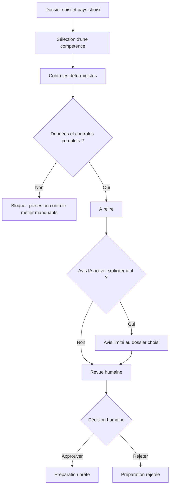

# Architecture des agents et des SKILLs

Version du 4 octobre 2026. Le code propose une démonstration locale et un mode de production à **instance et base isolées par entreprise**. Le déploiement et la recette chez le client restent nécessaires. Les agents ci-dessous sont des responsabilités et des regroupements de compétences ; le pilote n'exécute pas six agents autonomes en arrière-plan.

## Six spécialistes, douze procédures

| Spécialiste | SKILL | Priorité | Exécution actuelle |
|---|---|---|---|
| Contrôle documentaire | `invoice-check` | P0 | Champs, dates et arithmétique d'une facture simple structurée |
| Contrôle documentaire | `bookkeeping-pack` | P0 | Inventaire mensuel, doublons possibles, complétude déclarée et montants par devise |
| Contrôle documentaire | `expense-review` | P1 | Reçu OCR confirmé, contexte professionnel, politique déclarée et recherche de doublons ; aucun remboursement ni TVA déductible calculés |
| Encaissements et trésorerie | `receivables-followup` | P0 | Vérifications de facture, paiement/litige/échéance et brouillon local |
| Encaissements et trésorerie | `cash-visibility` | P1 | Guide de scénarios, contrôles métier non implémentés |
| Bureau administratif | `admin-triage` | P0 | Orientation par mots-clés, incertitude explicite |
| Bureau administratif | `weekly-brief` | P1 | Guide de synthèse, contrôles métier non implémentés |
| Échéances et conformité | `deadline-watch` | P1 | Guide de qualification des obligations, aucun calendrier automatique |
| Échéances et conformité | `compliance-watch` | P2 | Guide d'inventaire des preuves, aucune certification |
| Achats et contrats | `supplier-watch` | P1 | Guide de rapprochement et vérification fournisseur |
| Achats et contrats | `contract-watch` | P1 | Guide d'extraction des engagements, aucune interprétation juridique validée |
| Coordination RH | `hr-onboarding` | P2 | Guide d'arrivée d'un salarié déjà choisi, aucune décision RH automatique |

`implemented` signifie que le sous-ensemble indiqué possède un moteur déterministe : cinq workflows sont exécutables et sept restent guidés. Cela ne signifie ni conformité réglementaire complète ni intégration à un compte métier réel. `guided` signifie que la procédure détaillée existe, mais que le backend bloque son approbation faute de contrôles automatisés implémentés. Le catalogue `data/skills.json` est la source commune de l'interface et du serveur.

L'OCR est un service isolé de préparation des champs, avec original conservé et confirmation humaine. Le registre financier est un module déterministe séparé : factures validées, mouvements CSV, affectations versionnées et simulations d'affacturage. Il ne constitue pas un agent bancaire autonome. Les données du registre ne mettent pas automatiquement à jour les observations du workflow `receivables-followup` ; son opérateur doit en vérifier la fraîcheur.

## Flux d'une demande

L'avis IA est accessoire : il ne change ni les calculs ni les blocages. « Prête » désigne une préparation interne approuvée. Il n'existe pas de transition vers « email envoyé », « paiement effectué » ou « déclaration déposée ». Une réanalyse produit une nouvelle version à relire ; elle ne doit pas réutiliser silencieusement une approbation précédente.

## Context engineering : ne charger que le nécessaire

1. **Catalogue léger.** Le routeur et l'interface utilisent identifiant, description, pays et statut d'implémentation. Le contexte modèle ne contient pas les douze SKILLs.
2. **Un dossier.** Charger uniquement son titre, sa description, son payload et les contrôles déjà calculés. Pas de récupération implicite des autres tâches, des emails ou de l'historique global.
3. **Une compétence.** Charger le seul `skills/<id>/SKILL.md`. Les documents sont des données ; une instruction insérée dans une facture ne peut modifier la politique d'exécution.
4. **Un pays.** Charger seulement `skills/_shared/fr.md` ou `es.md` sélectionné par le serveur. Pour un besoin sans règle nationale, le guide sert au périmètre et ne déclenche aucune recherche automatique. Ne pas importer les règles d'un autre pays par ressemblance.
5. **Références conditionnelles.** Le contrat commun sert d'instruction à l'opérateur ou à un futur orchestrateur de skills. Le pilote IA n'ouvre pas automatiquement les liens Markdown des SKILLs ; sa politique serveur et son schéma de réponse imposent les frontières essentielles. Les sources officielles liées doivent être vérifiées par un opérateur avant application d'une règle.
6. **Sortie bornée.** Le modèle renvoie un avis séparé (`summary`, `suggested_draft`, `questions`, `evidence_fields`), pas un statut ni un ordre d'exécution. Le serveur conserve la responsabilité du résultat déterministe et de la revue.

Le routeur heuristique reste indicatif. Il n'assure pas que deux formulations équivalentes ou une demande complexe obtiendront la même orientation. L'opérateur peut sélectionner la compétence correcte ; les cas ambigus doivent rester visibles.

## Budgets et mesure des coûts

Valeurs de la première implémentation, à garder alignées avec `admin_agent/catalog.py` et `admin_agent/llm.py` :

| Limite | Valeur | Signification |
|---|---:|---|
| Texte d'un SKILL lu par le catalogue | 18 000 octets | Un dépassement est signalé ; tous les SKILLs livrés sont nettement plus courts |
| Contexte envoyé au modèle, politique incluse | 24 000 octets UTF-8 | Un dossier trop grand est refusé, pas tronqué silencieusement par l'adaptateur IA |
| Réponse du modèle | 1 200 tokens au maximum | Limite de sortie demandée au fournisseur |
| Réponse HTTP du fournisseur lue | 65 536 octets | Protection de lecture distincte du budget de tokens |
| Appels IA d'une analyse | Un au maximum | Pas de boucle d'auto-correction ou de multi-agent payante implicite |

L'estimation `octets UTF-8 / 4` est un indicateur approximatif ; elle n'est ni un comptage exact ni une garantie de plafond de tokens d'entrée. Le schéma de sortie et l'enveloppe du fournisseur peuvent ajouter des tokens. Les mesures de référence sont les compteurs `usage.input_tokens`, `usage.output_tokens`, `usage.total_tokens` renvoyés par le fournisseur. Si absents, le coût reste **non mesuré**, jamais zéro par défaut. En mode `offline`, aucun appel fournisseur n'est réalisé ; cela ne dit rien du coût du temps humain ou de l'hébergement.

Ne pas afficher un coût en euros sans compteurs réels, modèle exact, grille tarifaire datée, devise et taux de conversion éventuel. Le pilote n'embarque ni prix de modèle ni promesse d'économie. Pour une future facturation, rapprocher les usages du fournisseur avec ses relevés et traiter séparément cache, tokens de raisonnement et autres postes applicables. Une limite mensuelle monétaire, une réservation concurrente de budget et une alerte de dépassement restent à développer.

## Preuves et confiance

- **Déjà instrumenté :** manifeste du contexte local, empreinte du SKILL, volume de payload, absence d'autres tâches, contrôles exécutés et événements de revue. L'adaptateur IA ajoute modèle, fournisseur, empreinte du contexte, latence et usage retourné ; vérifier dans le code les champs conservés selon le mode.
- **Avis IA :** les chemins `evidence_fields` doivent exister dans le dossier soumis. Ce contrôle prouve l'existence du champ, pas que le texte généré l'interprète correctement ; la revue humaine reste obligatoire.
- **Procédure métier :** chaque skill demande un repère de pièce/page/ligne ou un champ de saisie, des hypothèses explicites et les informations manquantes. Pour les pièces importées, l'extraction conserve texte, page, coordonnées et empreinte de l'original ; l'opérateur confirme les valeurs avant leur utilisation.
- **Règle nationale :** conserver organisme, URL, date de consultation, date d'effet lorsqu'elle est établie, champ d'application et justification liée à l'entreprise. Les guides FR/ES sont des points de départ vérifiés le 2 octobre 2026, pas une veille permanente.
- **Livré pour la préparation de production :** empreintes et versions des pièces, provenance des champs confirmés, rôles/MFA, isolation par instance, sauvegarde cohérente et restauration en quarantaine. **À valider chez chaque client :** hébergement, HTTPS, sauvegarde chiffrée hors hôte, politique de conservation, qualité documentaire réelle et responsabilités. L'archivage et la montée en volume restent à développer.

Un score de confiance numérique non calibré n'améliore pas une preuve absente. Préférer « document consulté », « saisie déclarative », « contradiction » et « non vérifié ».

## Contrat de responsabilité

Le propriétaire du dossier vérifie sa complétude. Le dirigeant décide des priorités et valide le brouillon. Le comptable/gestor qualifie les sujets fiscaux et comptables ; le responsable RH vérifie les démarches sociales ; le juriste/DPO intervient selon la question. Ces rôles décrivent les revues nécessaires, pas des personnes déjà impliquées ni des validations acquises.

La clé IA reste côté serveur. L'activation en configuration et le choix explicite d'une analyse IA sont nécessaires pour envoyer le texte soumis au fournisseur. L'option `store:false` n'est pas, à elle seule, une garantie de zéro conservation chez le fournisseur : les conditions contractuelles, paramètres applicables et obligations de protection des données doivent être examinés avant tout dossier réel. Aucune capacité d'email ou de contact client n'est fournie au modèle.

## Boucle d'amélioration continue

1. Choisir un défaut observable : faux négatif bloquant, mauvaise orientation, montant erroné, preuve inexistante, réponse trompeuse ou friction de revue.
2. Ajouter un cas synthétique minimal dans `data/skill-evals.json` avant correction. Conserver un jeu de cas indépendants pour éviter l'apprentissage de quelques exemples.
3. Modifier la règle déterministe, la compétence ou l'interface au niveau responsable du défaut. Une consigne dans un SKILL ne répare pas un contrôle serveur manquant.
4. Exécuter les tests automatisés, puis vérifier le parcours interface et la sortie sur le cas. Les scénarios guidés et les comportements de modèle nécessitent une évaluation dédiée ; leur présence dans un fichier ne prouve pas qu'ils ont réussi.
5. Journaliser version, jeu de tests, résultat et limites ; comparer au dernier état valide. Ne pas annoncer un gain de temps sans mesure avant/après à périmètre comparable.
6. Prioriser d'abord les violations de frontière et erreurs de montant/statut, puis faux blocages, qualité des preuves, ergonomie et enfin coûts mesurés. Arrêter une itération quand les critères annoncés sont remplis, puis ouvrir le prochain défaut concret.

Les fixtures décrivent séparément les cas `deterministic` (exécutables contre le moteur local) et `behavioral` (spécifications de revue d'un opérateur/modèle, non validées par un simple test de chaîne). Critères de sortie : zéro action externe, aucun blocage levé par IA, montants reproductibles, pays respecté, inconnues visibles et provenance vérifiable.
